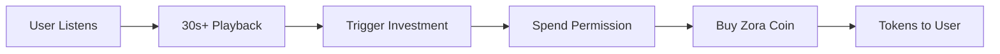

# 🎵 SongCast - Music Social Tokens Platform

[](https://docs.base.org)
[](https://docs.zora.co)
[]([https://farcaster.xyz](https://farcaster.xyz/miniapps/mYB-AY4azNE5/songcast))
[]([https://farcaster.xyz](https://songcast.xyz))

> **🏆 Hackathon Submission**: A revolutionary platform enabling music artists to create social tokens, build communities, and allow fans to invest directly in their musical journey through automated passive investment strategies.

## 🚀 **What Makes SongCast Special**

SongCast reimagines the music industry by combining **social tokens**, **passive investment automation**, and **decentralized music streaming** into a single platform that benefits both artists and fans.

### 🎯 **Core Innovation: Passive Music Investment**

The world's first **"Listen-to-Invest"** system that automatically purchases artist tokens while users listen to music, powered by Base Smart Wallet's Spend Limits.

## 🌟 **Key Features**

### 🎸 **For Artists**
- **Create Music Coins**: Launch social tokens tied to your music career
- **Revenue Streams**: Earn from coin trades, passive investments, and streaming
- **Community Building**: Foster direct fan engagement through token ownership
- **Farcaster Integration**: Share and promote directly in the Farcaster ecosystem

### 🎧 **For Fans**
- **Passive Investment**: Automatically invest in artists while listening
- **Music Discovery**: Explore new artists through their social tokens
- **Portfolio Management**: Track your music token investments
- **Social Sharing**: Share discoveries on Farcaster

### 🔧 **Technical Innovations**
- **Smart Spend Limits**: Secure, automated investments using Base's latest technology
- **Multi-platform Integration**: Seamless Farcaster Mini App experience
- **IPFS Music Storage**: Decentralized music and metadata hosting
- **Real-time Trading**: Instant buy/sell with market data

---

## 🎯 **ZORA PROTOCOL INTEGRATION** *(Sponsor Technology)*

SongCast is built as a **comprehensive implementation** of Zora's coins SDK, showcasing the full potential of their social token infrastructure:

### 📍 **Primary Integration Points**

#### 1. **Core Token Creation & Trading** (`app/hooks/useZoraCoins.ts`)
```typescript
import { 
  createCoin, 
  createCoinCall,
  tradeCoin, 
  tradeCoinCall,
  simulateBuy,
  getTradeFromLogs
} from '@zoralabs/coins-sdk';
```

**Features Implemented:**
- ✅ **Full Coin Creation**: Artists create tokens with metadata, pricing, and ownership structure
- ✅ **Advanced Trading**: Buy/sell with simulation and market data
- ✅ **Platform Referrer System**: Revenue sharing through Zora's referrer mechanism
- ✅ **Multi-currency Support**: ETH and ZORA token trading

#### 2. **Real-time Market Data** (`app/hooks/useZoraEvents.ts`)
```typescript
import { getCoin } from "@zoralabs/coins-sdk";
```

**Implementation:**
- 🔄 **Live Event Monitoring**: Tracks all Zora CoinCreated events on Base
- 📊 **Market Cap Tracking**: Real-time valuation using Zora's market data
- 🔍 **Smart Filtering**: Platform-specific coin discovery
- ⚡ **Optimized Performance**: Batch processing and caching

#### 3. **Automated Investment Engine** (`app/api/spend-limits/invest/route.ts`)
```typescript
import { tradeCoin } from '@zoralabs/coins-sdk';
```

**Innovation:**
- 🤖 **Passive Trading**: Automated coin purchases triggered by music listening
- 🛡️ **Secure Execution**: Uses Base Smart Wallet spend permissions
- 💰 **Direct Ownership**: Tokens delivered directly to user wallets

#### 4. **Market Analytics** (`app/hooks/useCoinStats.tsx`)
```typescript
import { getOnchainCoinDetails } from '@zoralabs/coins-sdk';
```

**Features:**
- 📈 **Price Discovery**: Real-time pricing and market metrics
- 📊 **Portfolio Tracking**: User investment analytics
- 🎯 **Investment Insights**: Performance tracking and recommendations

### 🏗️ **Platform Referrer Implementation**

SongCast operates as a **Zora Platform Referrer** with address `0x32C8ACD3118766CBE5c3E45a44BCEDde953EF627`, earning fees from all coin trades to sustain the platform:

```typescript
// Revenue sharing through Zora's referrer system
const tradeParams = {
  direction: 'buy' as const,
  target: coinAddress,
  args: {
    recipient: userAddress,
    orderSize: investmentAmount,
    tradeReferrer: process.env.NEXT_PUBLIC_SPENDER_ADDRESS // Platform referrer
  }
};
```

---

## 🛠️ **Technical Architecture**

### **Frontend Stack**
- **Next.js 14** with App Router
- **TypeScript** for type safety
- **TailwindCSS** + **Framer Motion** for UI/UX
- **Wagmi** + **Viem** for Web3 interactions

### **Blockchain Integration**
- **Base Network** for low-cost, fast transactions
- **Zora Coins Protocol** for social token infrastructure
- **Base Smart Wallet** for spend limit automation
- **IPFS** via Pinata for decentralized storage

### **Key Components Architecture**

```
🎵 SongCast Platform
├── 🎤 Artist Token Creation (Zora SDK)
├── 🔄 Automated Trading Engine (Base + Zora)
├── 📱 Farcaster Mini App Integration
├── 🎧 Music Streaming & Discovery
├── 💰 Passive Investment System
└── 📊 Real-time Market Analytics
```

---

## 🚀 **Getting Started for Judges**

### **Quick Demo Access**
- **Live Platform**: [songcast.vercel.app](https://songcast.xyz)
- **Farcaster Mini App**: Available in Farcaster clients
- **Demo Wallet**: Connect with Base 
### **Local Development Setup**

   ```bash
# Clone the repository
git clone https://github.com/your-username/songcast
cd songcast/music

# Install dependencies
   npm install

# Environment setup (see below)
cp env-template.txt .env.local

# Start development server
npm run dev
```

### **Required Environment Variables**

Create `.env.local` with the following (template provided in `env-template.txt`):

```bash
# Pinata IPFS (Required for music storage)
   NEXT_PUBLIC_PINATA_API_KEY=your_pinata_api_key
   NEXT_PUBLIC_PINATA_SECRET_KEY=your_pinata_secret_key

# Zora API (Optional - for rate limit increases)
NEXT_PUBLIC_ZORA_API_KEY=your_zora_api_key

# Base RPC (Optional - for better performance)
NEXT_PUBLIC_BASE_RPC=your_premium_rpc_url

# OnchainKit (For enhanced Base integration)
NEXT_PUBLIC_ONCHAINKIT_API_KEY=your_onchainkit_key

# Passive Investment (Advanced feature)
SPENDER_PRIVATE_KEY=0x... # Separate wallet for automated trades
NEXT_PUBLIC_SPENDER_ADDRESS=0x... # Address for above private key
```

---

## 🎵 **How SongCast Works**

### **1. Artist Onboarding**
1. **Connect Wallet**: Artists connect Base wallet
2. **Upload Music**: Upload audio files and cover art to IPFS
3. **Create Token**: Launch social token using Zora's protocol
4. **Community Building**: Fans discover and invest

### **2. Fan Investment Journey**
1. **Discover Music**: Browse tokens and listen to tracks
2. **Passive Setup**: Configure automated investment preferences
3. **Listen & Invest**: Tokens purchased automatically while listening
4. **Portfolio Growth**: Track investments and artist success

### **3. Automated Investment Flow**



---

## 🔐 **Security & Innovation Features**

### **Base Smart Wallet Integration**
- **Spend Limits**: Secure automated investing with daily limits
- **Permission Management**: Users maintain full control
- **Transparent Execution**: All transactions visible on-chain

### **Decentralized Architecture**
- **IPFS Storage**: Music and metadata stored decentrally
- **On-chain Ownership**: All tokens managed through smart contracts
- **Zero Custody**: Platform never holds user assets

---

## 📱 **Farcaster Mini App**

SongCast includes a fully integrated Farcaster Mini App (`/app/miniapp/`) enabling:

- **Native Discovery**: Explore music tokens within Farcaster
- **Social Sharing**: Share favorite artists and tokens
- **Seamless Authentication**: Sign in with Farcaster
- **Frame Integration**: Interactive music discovery frames

### **Mini App Features**
- Direct token trading within Farcaster
- Music previews and artist profiles
- Social proof and community metrics
- Cross-platform token sharing

---

## 🏗️ **Advanced Features**

### **Passive Investment System**
The platform's most innovative feature uses Base Smart Wallet's Spend Limits:

```typescript
// Automated investment triggered by music listening
const executePassiveInvestment = async () => {
  // 1. Transfer user ETH via spend permission
  const spendResult = await executeSpendPermission();
  
  // 2. Purchase music coin via Zora SDK
  const tradeResult = await tradeCoin(params, wallet, publicClient);
  
  // 3. Send coins directly to user wallet
  return tradeResult;
};
```

**Key Benefits:**
- ✅ **Set & Forget**: Configure once, invest automatically
- ✅ **Daily Limits**: Built-in spending protection
- ✅ **Direct Ownership**: Coins delivered to user's wallet
- ✅ **Revokable**: Users can stop anytime

### **Real-time Market Data**
- Live price feeds from Zora protocol
- Market cap calculations and trending metrics
- Portfolio analytics and performance tracking
- Advanced filtering and discovery algorithms

---

## 🎯 **Demo Scenarios for Judges**

### **Scenario 1: Artist Token Creation**
1. Visit the platform and connect wallet
2. Navigate to "Create Coin" section
3. Upload sample music file and cover art
4. Configure token parameters (name, symbol, etc.)
5. Launch token using Zora's protocol

### **Scenario 2: Passive Investment**
1. Explore existing music tokens
2. Set up passive investment (small amounts recommended)
3. Listen to music for 30+ seconds
4. Observe automatic token purchase
5. Check wallet for received tokens

### **Scenario 3: Farcaster Integration**
1. Access SongCast Mini App in Farcaster
2. Discover and share music tokens
3. Test frame interactions and social features

---

## 📊 **Business Model & Sustainability**

### **Revenue Streams**
1. **Platform Referrer Fees**: Revenue from Zora trade fees
2. **Premium Features**: Advanced analytics and tools
3. **Artist Services**: Promotion and marketing tools

### **Value Proposition**
- **For Artists**: New revenue streams and direct fan connection
- **For Fans**: Investment opportunity in favorite artists
- **For Platform**: Sustainable fee-based model through Zora

---

## 🔧 **Technical Implementation Details**

### **Smart Contract Integration**
- **Zora Factory**: `0x777777751622c0d3258f214F9DF38E35BF45baF3`
- **Platform Referrer**: `0x32C8ACD3118766CBE5c3E45a44BCEDde953EF627`
- **Spend Permission Manager**: Base's smart wallet system

### **File Structure**
```
music/
├── app/
│   ├── hooks/
│   │   ├── useZoraCoins.ts          # Core Zora SDK integration
│   │   ├── useZoraEvents.ts         # Real-time market data
│   │   └── useSpendLimits.ts        # Passive investment logic
│   ├── components/
│   │   ├── CreateMusicCoin.tsx      # Token creation UI
│   │   ├── TradeMusicCoin.tsx       # Trading interface
│   │   └── PassiveInvestmentManager.tsx # Investment setup
│   ├── api/
│   │   ├── spend-limits/            # Passive investment APIs
│   │   └── pinata/                  # IPFS storage APIs
│   └── miniapp/                     # Farcaster Mini App
├── contracts/                       # Smart contract source
└── public/                         # Static assets
```

---

## 🌟 **Innovation Highlights**

### **What Makes This Special**
1. **First "Listen-to-Invest"**: Automated investment while enjoying music
2. **Complete Zora Showcase**: Full implementation of social token capabilities  
3. **Cross-platform Integration**: Seamless Farcaster and web experience
4. **Artist-Centric**: Direct monetization without intermediaries
5. **Fan Engagement**: Investment creates deeper connection to artists

### **Technical Achievements**
- ✅ **Complex State Management**: Real-time sync across trading, listening, and investing
- ✅ **Advanced Web3 UX**: Seamless wallet interactions and transaction management
- ✅ **Performance Optimization**: Efficient data fetching and caching strategies
- ✅ **Security First**: Comprehensive spend limit integration and user protection

---

## 📋 **Future Roadmap**

### **Phase 1: Core Platform** ✅
- Zora token integration
- Basic trading functionality
- Music streaming capability

### **Phase 2: Automation** ✅ 
- Passive investment system
- Base Smart Wallet integration
- Advanced security features

### **Phase 3: Social Features** ✅
- Farcaster Mini App
- Social discovery and sharing
- Community features

### **Phase 4: Advanced Analytics** 🔄
- Portfolio management tools
- Market insights and predictions
- Artist growth analytics

### **Phase 5: Mobile & Scale** 📅
- Native mobile applications
- Enhanced performance optimization
- Global expansion features

---

## ⚖️ **License & Usage**

**© 2024 SongCast. Proprietary Software.**

This codebase is provided for **hackathon judging purposes only**. While publicly visible for transparency and evaluation, it contains proprietary business logic, innovative algorithms, and integrated systems that represent significant development investment.

**Usage Rights:**
- ✅ **Judges**: Full access for evaluation and testing
- ✅ **Educational**: Code review and learning purposes
- ❌ **Commercial**: No commercial use without explicit permission
- ❌ **Redistribution**: No copying or redistribution of core business logic

**Key Proprietary Components:**
- Passive investment algorithm and timing strategies
- Zora protocol integration patterns and optimizations
- Cross-platform sync and state management architecture
- Advanced market data processing and analytics

For collaboration, partnership, or licensing inquiries, please contact the development team.

---

## 🤝 **Contact & Demo**

- **Live Platform**: [songcast.vercel.app](https://songcast.vercel.app)
- **Demo Video**: [Available on platform]
- **Team Contact**: [Contact information]
- **Technical Questions**: Available for live demo and Q&A

---

## 🏆 **Hackathon Integration Summary**

**Zora Protocol Usage:**
- ✅ Complete implementation of Zora coins SDK
- ✅ Platform referrer integration for sustainability
- ✅ Advanced trading features and market data
- ✅ Innovation in automated investment strategies

**Base Network Features:**
- ✅ Smart Wallet spend limits for automated investing
- ✅ Optimized for Base's low-cost, fast transactions
- ✅ OnchainKit integration for enhanced UX

**Innovation Factor:**
- 🥇 First automated music investment platform
- 🥇 Comprehensive social token ecosystem for music
- 🥇 Cross-platform Web3 experience (web + Farcaster)

---

*Built with ❤️ for the future of music and Web3* 
